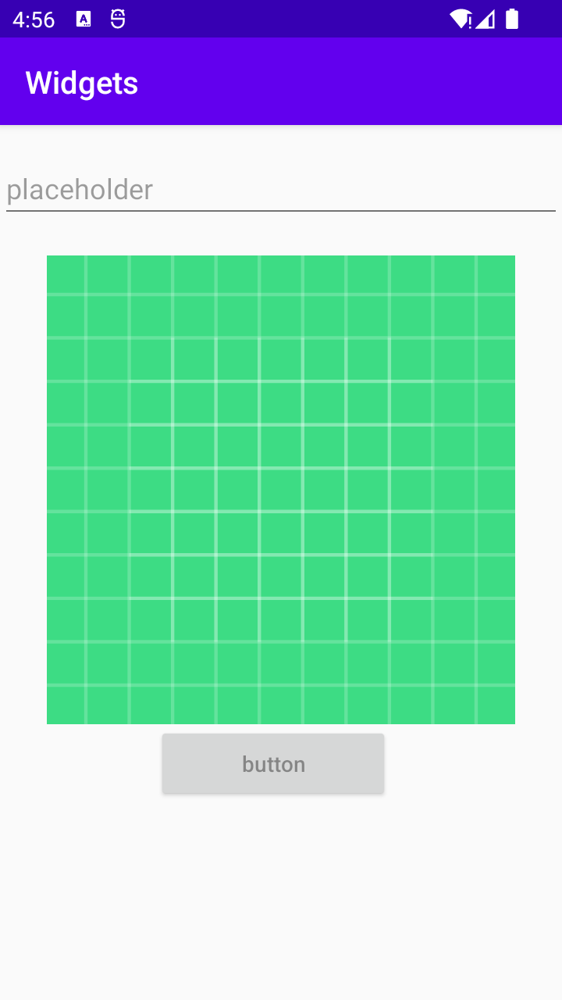

# Rapport
Uppgiften gick ut på att skapa en layout med tre olika aktiviteter, det har skapats en edittext som är en ruta där det går att skriva in text. Det har skapats en imageview som är en bild, imageview koden är i kodsnutten. Tillsist skapades en button på liknande sett som alla tre har skapats med en width, height och marginaler. Match_parent i width och height utgår ifrån layoutens bredd och höjd.
```
<ImageView
        android:layout_width="match_parent"
        android:layout_height="300dp"
        android:id="@+id/imgview"
        android:contentDescription="logo"
        android:layout_marginTop="20dp"
        android:src="@drawable/ic_launcher_background" />
```
